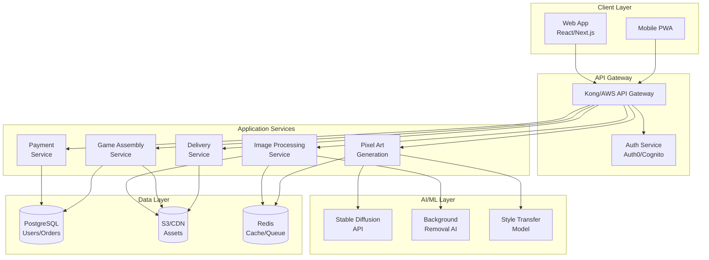

# Technical Implementation Plan

## System Architecture Overview



## Core Services Implementation

### 1. Image Processing Service

#### API Endpoints
```typescript
POST /api/images/upload
  - Accepts: multipart/form-data
  - Returns: { imageId, processedUrl, metadata }

POST /api/images/remove-background
  - Body: { imageId }
  - Returns: { processedImageUrl, mask }

POST /api/images/crop
  - Body: { imageId, cropData }
  - Returns: { croppedImageUrl }

GET /api/images/{imageId}/status
  - Returns: { status, progress, result }
```

#### Implementation Details
```javascript
// services/image-processing/index.js
import sharp from 'sharp';
import { RemoveBgAPI } from '@remove-bg/api';
import { S3Client } from '@aws-sdk/client-s3';
import Bull from 'bull';

class ImageProcessingService {
  constructor() {
    this.queue = new Bull('image-processing', {
      redis: process.env.REDIS_URL
    });
    this.s3 = new S3Client({ region: 'us-east-1' });
    this.removeBg = new RemoveBgAPI(process.env.REMOVE_BG_KEY);
  }

  async processUpload(file) {
    // Validate file
    const validation = await this.validateImage(file);
    if (!validation.valid) {
      throw new Error(validation.error);
    }

    // Generate unique ID
    const imageId = generateUUID();
    
    // Upload original to S3
    const originalUrl = await this.uploadToS3(file, `originals/${imageId}`);
    
    // Queue background removal
    await this.queue.add('remove-background', {
      imageId,
      originalUrl
    });

    return {
      imageId,
      status: 'processing',
      originalUrl
    };
  }

  async removeBackground(imageId, imageUrl) {
    try {
      // Use Remove.bg API
      const result = await this.removeBg.removeBackground({
        image_url: imageUrl,
        size: 'preview',
        type: 'animal'
      });

      // Fallback to U^2-Net if Remove.bg fails
      if (!result.success) {
        result = await this.u2netFallback(imageUrl);
      }

      // Save processed image
      const processedUrl = await this.uploadToS3(
        result.image,
        `processed/${imageId}`
      );

      return {
        success: true,
        processedUrl,
        mask: result.mask
      };
    } catch (error) {
      console.error('Background removal failed:', error);
      throw error;
    }
  }

  async validateImage(file) {
    const validTypes = ['image/jpeg', 'image/png', 'image/heic'];
    const maxSize = 10 * 1024 * 1024; // 10MB

    if (!validTypes.includes(file.mimetype)) {
      return { valid: false, error: 'Invalid file type' };
    }

    if (file.size > maxSize) {
      return { valid: false, error: 'File too large' };
    }

    // Check image dimensions
    const metadata = await sharp(file.buffer).metadata();
    if (metadata.width < 500 || metadata.height < 500) {
      return { valid: false, error: 'Image resolution too low' };
    }

    return { valid: true };
  }
}
```

### 2. Pixel Art Generation Service

#### API Endpoints
```typescript
POST /api/pixel-art/generate
  - Body: { imageId, style, resolution }
  - Returns: { spriteSheetUrl, animations }

POST /api/pixel-art/customize
  - Body: { spriteId, adjustments }
  - Returns: { updatedSpriteUrl }

GET /api/pixel-art/styles
  - Returns: { styles: [...] }
```

#### Implementation Details
```python
# services/pixel_art_generation/generator.py
import torch
from diffusers import StableDiffusionImg2ImgPipeline
from PIL import Image
import numpy as np

class PixelArtGenerator:
    def __init__(self):
        self.model = self.load_model()
        self.styles = {
            '8bit': 'pixel art, 8-bit style, retro game sprite',
            '16bit': 'pixel art, 16-bit style, SNES era sprite',
            'modern': 'pixel art, modern indie game style'
        }
    
    def load_model(self):
        """Load fine-tuned Stable Diffusion model"""
        model_id = "custom/pet-pixel-art-v1"
        pipe = StableDiffusionImg2ImgPipeline.from_pretrained(
            model_id,
            torch_dtype=torch.float16
        )
        pipe = pipe.to("cuda")
        return pipe
    
    def generate_sprite(self, image_path, style='16bit', size=32):
        """Generate pixel art sprite from pet image"""
        # Load and preprocess image
        image = Image.open(image_path).convert("RGBA")
        image = self.prepare_image(image, size)
        
        # Generate prompt
        prompt = f"{self.styles[style]}, cute animal character, game sprite"
        negative_prompt = "blurry, realistic, photograph, 3d render"
        
        # Generate pixel art
        result = self.model(
            prompt=prompt,
            negative_prompt=negative_prompt,
            image=image,
            strength=0.75,
            guidance_scale=7.5,
            num_inference_steps=50
        ).images[0]
        
        # Post-process
        result = self.quantize_colors(result, colors=16)
        result = self.ensure_pixel_perfect(result, size)
        
        return result
    
    def generate_sprite_sheet(self, base_sprite):
        """Create full sprite sheet with animations"""
        animations = {
            'idle': self.create_idle_animation(base_sprite),
            'walk': self.create_walk_animation(base_sprite),
            'jump': self.create_jump_animation(base_sprite),
            'special': self.create_special_animation(base_sprite)
        }
        
        # Combine into sprite sheet
        sprite_sheet = self.combine_animations(animations)
        return sprite_sheet, animations
    
    def create_walk_animation(self, sprite, frames=4):
        """Generate walk cycle frames"""
        frames_list = []
        for i in range(frames):
            # Apply transformation for walk cycle
            angle = (i / frames) * 10 - 5  # Slight rotation
            offset = np.sin(i / frames * np.pi * 2) * 2  # Bounce
            
            frame = sprite.copy()
            frame = self.apply_transform(frame, angle, offset)
            frames_list.append(frame)
        
        return frames_list
```

### 3. Game Assembly Service

#### API Endpoints
```typescript
POST /api/games/create
  - Body: { userId, sprites, config }
  - Returns: { gameId, status }

GET /api/games/{gameId}
  - Returns: { gameUrl, metadata }

POST /api/games/{gameId}/customize
  - Body: { customizations }
  - Returns: { updated: true }
```

#### Implementation Details
```javascript
// services/game-assembly/assembler.js
import { GameEngine } from './engine';
import { LevelGenerator } from './level-generator';
import { AssetManager } from './asset-manager';

class GameAssembler {
  constructor() {
    this.engine = new GameEngine();
    this.levelGen = new LevelGenerator();
    this.assets = new AssetManager();
  }

  async assembleGame(config) {
    const gameId = generateGameId();
    
    // Create game structure
    const gameData = {
      id: gameId,
      config: config,
      levels: [],
      assets: {},
      metadata: {}
    };

    // Generate levels based on config
    for (let i = 0; i < config.levelCount; i++) {
      const level = await this.levelGen.generateLevel({
        theme: config.theme,
        difficulty: config.difficulty,
        index: i,
        special: i === config.levelCount - 1 ? 'boss' : null
      });
      gameData.levels.push(level);
    }

    // Process and inject custom sprites
    gameData.assets.sprites = await this.injectSprites(
      config.sprites,
      config.style
    );

    // Generate game package
    const gamePackage = await this.packageGame(gameData);
    
    // Deploy to CDN
    const gameUrl = await this.deployGame(gamePackage, gameId);
    
    return {
      gameId,
      gameUrl,
      status: 'ready'
    };
  }

  async generateLevel(config) {
    const template = this.getTemplate(config.theme);
    const level = {
      width: template.width,
      height: template.height,
      tiles: [],
      entities: [],
      collectibles: []
    };

    // Generate terrain
    level.tiles = this.generateTerrain(template, config.difficulty);
    
    // Place enemies
    level.entities = this.placeEnemies(
      level.tiles,
      config.difficulty
    );
    
    // Add collectibles
    level.collectibles = this.placeCollectibles(
      level.tiles,
      config.difficulty
    );

    return level;
  }

  packageGame(gameData) {
    // Create HTML5 game package
    const html = this.generateHTML(gameData);
    const js = this.generateJS(gameData);
    const css = this.generateCSS(gameData);
    const assets = this.bundleAssets(gameData);

    return {
      'index.html': html,
      'game.js': js,
      'styles.css': css,
      'assets/': assets
    };
  }
}
```

### 4. Game Engine Implementation

```javascript
// game-engine/core.js
export class PetGame {
  constructor(config) {
    this.config = config;
    this.canvas = document.getElementById('game-canvas');
    this.ctx = this.canvas.getContext('2d');
    this.sprites = {};
    this.currentLevel = 0;
    this.player = null;
    this.entities = [];
    this.score = 0;
  }

  async init() {
    // Load assets
    await this.loadAssets();
    
    // Initialize player
    this.player = new Player({
      sprite: this.sprites.player,
      abilities: this.config.abilities,
      x: 100,
      y: 300
    });
    
    // Load first level
    this.loadLevel(0);
    
    // Start game loop
    this.startGameLoop();
  }

  async loadAssets() {
    const assetPromises = Object.entries(this.config.assets).map(
      async ([key, url]) => {
        const img = new Image();
        img.src = url;
        await img.decode();
        this.sprites[key] = img;
      }
    );
    await Promise.all(assetPromises);
  }

  loadLevel(index) {
    const levelData = this.config.levels[index];
    
    // Clear existing entities
    this.entities = [];
    
    // Create level tiles
    this.level = new Level(levelData, this.sprites);
    
    // Spawn enemies
    levelData.entities.forEach(entity => {
      this.entities.push(new Enemy(entity, this.sprites));
    });
    
    // Place collectibles
    this.collectibles = levelData.collectibles.map(
      item => new Collectible(item, this.sprites)
    );
  }

  update(deltaTime) {
    // Update player
    this.player.update(deltaTime);
    
    // Check collisions
    this.checkCollisions();
    
    // Update entities
    this.entities.forEach(entity => entity.update(deltaTime));
    
    // Check win condition
    if (this.player.x > this.level.width - 100) {
      this.nextLevel();
    }
  }

  render() {
    // Clear canvas
    this.ctx.clearRect(0, 0, this.canvas.width, this.canvas.height);
    
    // Render level
    this.level.render(this.ctx);
    
    // Render entities
    this.entities.forEach(entity => entity.render(this.ctx));
    
    // Render collectibles
    this.collectibles.forEach(item => item.render(this.ctx));
    
    // Render player
    this.player.render(this.ctx);
    
    // Render UI
    this.renderUI();
  }

  startGameLoop() {
    let lastTime = 0;
    
    const loop = (timestamp) => {
      const deltaTime = timestamp - lastTime;
      lastTime = timestamp;
      
      this.update(deltaTime);
      this.render();
      
      requestAnimationFrame(loop);
    };
    
    requestAnimationFrame(loop);
  }
}
```

### 5. Infrastructure Configuration

#### Docker Compose Development
```yaml
# docker-compose.yml
version: '3.8'

services:
  web:
    build: ./frontend
    ports:
      - "3000:3000"
    environment:
      - NEXT_PUBLIC_API_URL=http://localhost:4000
    volumes:
      - ./frontend:/app
      - /app/node_modules

  api-gateway:
    image: kong:latest
    ports:
      - "4000:8000"
      - "4001:8001"
    environment:
      - KONG_DATABASE=postgres
      - KONG_PG_HOST=postgres
      - KONG_PG_PASSWORD=kong

  image-service:
    build: ./services/image-processing
    ports:
      - "4010:3000"
    environment:
      - REDIS_URL=redis://redis:6379
      - S3_BUCKET=pet-games-dev
      - REMOVE_BG_KEY=${REMOVE_BG_KEY}
    depends_on:
      - redis
      - postgres

  pixel-art-service:
    build: ./services/pixel-art
    ports:
      - "4011:3000"
    environment:
      - MODEL_PATH=/models
      - REDIS_URL=redis://redis:6379
    volumes:
      - ./models:/models
    deploy:
      resources:
        reservations:
          devices:
            - driver: nvidia
              count: 1
              capabilities: [gpu]

  game-service:
    build: ./services/game-assembly
    ports:
      - "4012:3000"
    environment:
      - REDIS_URL=redis://redis:6379
      - S3_BUCKET=pet-games-dev

  postgres:
    image: postgres:14
    environment:
      - POSTGRES_DB=petgames
      - POSTGRES_USER=admin
      - POSTGRES_PASSWORD=secret
    volumes:
      - postgres_data:/var/lib/postgresql/data
    ports:
      - "5432:5432"

  redis:
    image: redis:7-alpine
    ports:
      - "6379:6379"
    volumes:
      - redis_data:/data

  minio:
    image: minio/minio
    ports:
      - "9000:9000"
      - "9001:9001"
    environment:
      - MINIO_ROOT_USER=minioadmin
      - MINIO_ROOT_PASSWORD=minioadmin
    command: server /data --console-address ":9001"
    volumes:
      - minio_data:/data

volumes:
  postgres_data:
  redis_data:
  minio_data:
```

#### Kubernetes Production
```yaml
# k8s/deployment.yaml
apiVersion: apps/v1
kind: Deployment
metadata:
  name: pet-game-api
  namespace: production
spec:
  replicas: 3
  selector:
    matchLabels:
      app: pet-game-api
  template:
    metadata:
      labels:
        app: pet-game-api
    spec:
      containers:
      - name: api
        image: petgames/api:latest
        ports:
        - containerPort: 3000
        env:
        - name: NODE_ENV
          value: "production"
        - name: DATABASE_URL
          valueFrom:
            secretKeyRef:
              name: database-secret
              key: url
        resources:
          requests:
            memory: "256Mi"
            cpu: "250m"
          limits:
            memory: "512Mi"
            cpu: "500m"
        livenessProbe:
          httpGet:
            path: /health
            port: 3000
          initialDelaySeconds: 30
          periodSeconds: 10
---
apiVersion: v1
kind: Service
metadata:
  name: pet-game-api-service
spec:
  selector:
    app: pet-game-api
  ports:
  - port: 80
    targetPort: 3000
  type: LoadBalancer
---
apiVersion: autoscaling/v2
kind: HorizontalPodAutoscaler
metadata:
  name: pet-game-api-hpa
spec:
  scaleTargetRef:
    apiVersion: apps/v1
    kind: Deployment
    name: pet-game-api
  minReplicas: 3
  maxReplicas: 10
  metrics:
  - type: Resource
    resource:
      name: cpu
      target:
        type: Utilization
        averageUtilization: 70
  - type: Resource
    resource:
      name: memory
      target:
        type: Utilization
        averageUtilization: 80
```

### 6. Database Schema

```sql
-- PostgreSQL Schema
CREATE SCHEMA petgames;

-- Users table
CREATE TABLE petgames.users (
    id UUID PRIMARY KEY DEFAULT gen_random_uuid(),
    email VARCHAR(255) UNIQUE NOT NULL,
    name VARCHAR(255),
    auth_provider VARCHAR(50),
    auth_id VARCHAR(255),
    subscription_tier VARCHAR(50) DEFAULT 'free',
    created_at TIMESTAMP DEFAULT CURRENT_TIMESTAMP,
    updated_at TIMESTAMP DEFAULT CURRENT_TIMESTAMP
);

-- Orders table
CREATE TABLE petgames.orders (
    id UUID PRIMARY KEY DEFAULT gen_random_uuid(),
    user_id UUID REFERENCES petgames.users(id),
    package_type VARCHAR(50) NOT NULL,
    amount DECIMAL(10, 2) NOT NULL,
    currency VARCHAR(3) DEFAULT 'USD',
    status VARCHAR(50) DEFAULT 'pending',
    stripe_payment_id VARCHAR(255),
    created_at TIMESTAMP DEFAULT CURRENT_TIMESTAMP,
    completed_at TIMESTAMP
);

-- Games table
CREATE TABLE petgames.games (
    id UUID PRIMARY KEY DEFAULT gen_random_uuid(),
    user_id UUID REFERENCES petgames.users(id),
    order_id UUID REFERENCES petgames.orders(id),
    short_code VARCHAR(10) UNIQUE NOT NULL,
    game_url TEXT NOT NULL,
    config JSONB NOT NULL,
    assets JSONB,
    metadata JSONB,
    views INTEGER DEFAULT 0,
    shares INTEGER DEFAULT 0,
    created_at TIMESTAMP DEFAULT CURRENT_TIMESTAMP,
    expires_at TIMESTAMP
);

-- Uploads table
CREATE TABLE petgames.uploads (
    id UUID PRIMARY KEY DEFAULT gen_random_uuid(),
    user_id UUID REFERENCES petgames.users(id),
    game_id UUID REFERENCES petgames.games(id),
    file_type VARCHAR(50),
    original_url TEXT,
    processed_url TEXT,
    sprite_url TEXT,
    metadata JSONB,
    created_at TIMESTAMP DEFAULT CURRENT_TIMESTAMP
);

-- Analytics events table
CREATE TABLE petgames.events (
    id BIGSERIAL PRIMARY KEY,
    user_id UUID,
    session_id UUID,
    event_type VARCHAR(100),
    event_data JSONB,
    created_at TIMESTAMP DEFAULT CURRENT_TIMESTAMP
);

-- Create indexes
CREATE INDEX idx_users_email ON petgames.users(email);
CREATE INDEX idx_orders_user_id ON petgames.orders(user_id);
CREATE INDEX idx_games_user_id ON petgames.games(user_id);
CREATE INDEX idx_games_short_code ON petgames.games(short_code);
CREATE INDEX idx_events_user_id ON petgames.events(user_id);
CREATE INDEX idx_events_created_at ON petgames.events(created_at);
```

### 7. API Security Implementation

```javascript
// middleware/security.js
import rateLimit from 'express-rate-limit';
import helmet from 'helmet';
import cors from 'cors';
import { validateToken } from './auth';

// Rate limiting
export const apiLimiter = rateLimit({
  windowMs: 15 * 60 * 1000, // 15 minutes
  max: 100, // limit each IP to 100 requests per windowMs
  message: 'Too many requests from this IP'
});

export const uploadLimiter = rateLimit({
  windowMs: 60 * 60 * 1000, // 1 hour
  max: 10, // limit uploads to 10 per hour
  message: 'Upload limit exceeded'
});

// CORS configuration
export const corsOptions = {
  origin: process.env.ALLOWED_ORIGINS?.split(',') || '*',
  credentials: true,
  optionsSuccessStatus: 200
};

// Security headers
export const securityHeaders = helmet({
  contentSecurityPolicy: {
    directives: {
      defaultSrc: ["'self'"],
      styleSrc: ["'self'", "'unsafe-inline'"],
      scriptSrc: ["'self'", "'unsafe-inline'", 'https://js.stripe.com'],
      imgSrc: ["'self'", 'data:', 'https:'],
      connectSrc: ["'self'", 'https://api.stripe.com']
    }
  }
});

// JWT validation middleware
export const requireAuth = async (req, res, next) => {
  try {
    const token = req.headers.authorization?.split(' ')[1];
    if (!token) {
      return res.status(401).json({ error: 'No token provided' });
    }

    const decoded = await validateToken(token);
    req.user = decoded;
    next();
  } catch (error) {
    return res.status(401).json({ error: 'Invalid token' });
  }
};

// Input validation
export const validateInput = (schema) => {
  return (req, res, next) => {
    const { error } = schema.validate(req.body);
    if (error) {
      return res.status(400).json({
        error: error.details[0].message
      });
    }
    next();
  };
};
```

### 8. Monitoring & Logging

```javascript
// monitoring/index.js
import { createLogger, format, transports } from 'winston';
import * as Sentry from '@sentry/node';
import { StatsD } from 'node-statsd';

// Initialize Sentry
Sentry.init({
  dsn: process.env.SENTRY_DSN,
  environment: process.env.NODE_ENV,
  tracesSampleRate: 1.0
});

// StatsD client for metrics
const metrics = new StatsD({
  host: process.env.STATSD_HOST || 'localhost',
  port: 8125,
  prefix: 'petgames.'
});

// Winston logger
const logger = createLogger({
  level: process.env.LOG_LEVEL || 'info',
  format: format.combine(
    format.timestamp(),
    format.errors({ stack: true }),
    format.json()
  ),
  defaultMeta: { service: 'pet-games' },
  transports: [
    new transports.File({ filename: 'error.log', level: 'error' }),
    new transports.File({ filename: 'combined.log' }),
    new transports.Console({
      format: format.combine(
        format.colorize(),
        format.simple()
      )
    })
  ]
});

// Monitoring utilities
export const monitor = {
  // Track API request
  trackRequest: (endpoint, duration, status) => {
    metrics.timing(`api.${endpoint}.duration`, duration);
    metrics.increment(`api.${endpoint}.${status}`);
  },

  // Track business metrics
  trackConversion: (step, success) => {
    metrics.increment(`conversion.${step}.${success ? 'success' : 'failure'}`);
  },

  // Track game generation
  trackGameGeneration: (duration, success) => {
    metrics.timing('game.generation.duration', duration);
    metrics.increment(`game.generation.${success ? 'success' : 'failure'}`);
  },

  // Log errors
  logError: (error, context = {}) => {
    logger.error({
      message: error.message,
      stack: error.stack,
      ...context
    });
    Sentry.captureException(error, { extra: context });
  }
};
```

## Performance Optimization

### CDN Configuration
```nginx
# nginx.conf for CDN edge servers
server {
    listen 80;
    server_name games.petpixel.com;

    location / {
        proxy_cache game_cache;
        proxy_cache_valid 200 302 7d;
        proxy_cache_valid 404 1m;
        proxy_cache_use_stale error timeout invalid_header updating;
        proxy_cache_background_update on;
        proxy_cache_lock on;
        
        add_header X-Cache-Status $upstream_cache_status;
        add_header Cache-Control "public, max-age=604800";
        
        proxy_pass http://origin.petpixel.com;
    }

    location ~* \.(jpg|jpeg|png|gif|ico|css|js)$ {
        expires 30d;
        add_header Cache-Control "public, immutable";
    }
}
```

### Redis Caching Strategy
```javascript
// cache/strategies.js
export const cacheStrategies = {
  // Cache processed images for 24 hours
  processedImages: {
    ttl: 86400,
    key: (imageId) => `img:processed:${imageId}`
  },

  // Cache generated sprites for 7 days
  sprites: {
    ttl: 604800,
    key: (spriteId) => `sprite:${spriteId}`
  },

  // Cache game configs indefinitely
  gameConfigs: {
    ttl: null,
    key: (gameId) => `game:config:${gameId}`
  },

  // Cache user sessions for 1 hour
  sessions: {
    ttl: 3600,
    key: (sessionId) => `session:${sessionId}`
  }
};
```

---

*This completes the BMad Method planning phase. Ready to proceed with implementation.*