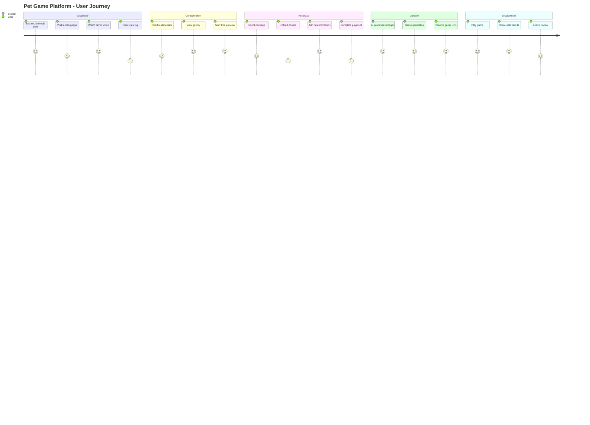
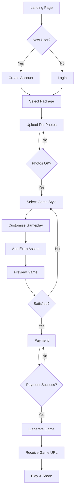

# User Journey & Customization Flow

## User Journey Map

### Discovery to Purchase Journey



## Detailed Customization Flow

### Step 1: Welcome & Package Selection
**Screen: Landing/Welcome**
- Hero video showing transformation
- "Create Your Pet's Game" CTA
- Package comparison table
- Trust signals (reviews, examples)

**User Actions:**
1. Click "Get Started"
2. Select package (Basic/Premium/Creator)
3. Create account or continue as guest

### Step 2: Pet Photo Upload
**Screen: Photo Upload Interface**

```
┌─────────────────────────────────────┐
│         Upload Your Pet             │
├─────────────────────────────────────┤
│                                     │
│    ┌──────────┐  ┌──────────┐     │
│    │          │  │          │     │
│    │  Hero    │  │ Sidekick │     │
│    │  Photo   │  │  Photo   │     │
│    │          │  │(Optional)│     │
│    └──────────┘  └──────────┘     │
│                                     │
│  Requirements:                      │
│  • Clear face visible              │
│  • Good lighting                   │
│  • Min 500x500px                   │
│                                     │
│  [Upload Photos] [Take Photo]      │
└─────────────────────────────────────┘
```

**Processing Steps:**
1. Background removal (automatic)
2. Preview with transparent background
3. Approve or retake
4. Name your character

### Step 3: Game Style Selection
**Screen: Style Customization**

```
┌─────────────────────────────────────┐
│      Choose Your Adventure          │
├─────────────────────────────────────┤
│                                     │
│  World Theme:                       │
│  ┌─────┐ ┌─────┐ ┌─────┐ ┌─────┐ │
│  │Garden│ │House│ │Beach│ │Space│ │
│  └─────┘ └─────┘ └─────┘ └─────┘ │
│                                     │
│  Game Mood:                         │
│  ( ) Relaxing - Easy, exploration  │
│  (•) Adventure - Moderate challenge │
│  ( ) Challenge - Difficult gameplay │
│                                     │
│  Color Palette:                     │
│  [Bright] [Pastel] [Retro] [Dark]  │
│                                     │
└─────────────────────────────────────┘
```

### Step 4: Gameplay Customization
**Screen: Gameplay Options**

**Text Prompt Interface:**
```
Describe your pet's adventure (optional):
┌────────────────────────────────────┐
│ "My cat Luna loves chasing          │
│  butterflies in the garden and      │
│  climbing trees"                    │
└────────────────────────────────────┘

Special abilities for your pet:
[✓] Double Jump (cats)
[✓] Speed Boost
[ ] Gliding
[ ] Wall Climb
```

**Level Customization:**
- Number of levels: [3] [5] [7] [10]
- Boss battle: [Yes] [No]
- Collectibles: [Treats] [Toys] [Custom]

### Step 5: Additional Assets
**Screen: Extra Customization**

```
Add Special Items (Optional):
┌──────────┐ ┌──────────┐ ┌──────────┐
│          │ │          │ │          │
│ Favorite │ │  Custom  │ │  Power   │
│   Toy    │ │   Item   │ │    Up    │
│          │ │          │ │          │
└──────────┘ └──────────┘ └──────────┘
     +            +            +
```

### Step 6: Preview & Adjust
**Screen: Game Preview**

```
┌─────────────────────────────────────┐
│         Preview Your Game           │
├─────────────────────────────────────┤
│                                     │
│     [Live Preview Window]           │
│                                     │
│  Adjustments:                       │
│  Character Size: [--●----]          │
│  Jump Height:    [----●--]          │
│  Game Speed:     [---●---]          │
│                                     │
│  [Back] [Generate Full Game]        │
└─────────────────────────────────────┘
```

### Step 7: Payment
**Screen: Checkout**

Standard payment flow with:
- Order summary
- Promo code field
- Payment methods (Card, PayPal, etc.)
- Gift option (send to email)

### Step 8: Generation Status
**Screen: Processing**

```
┌─────────────────────────────────────┐
│     Creating Your Game Magic! 🎮     │
├─────────────────────────────────────┤
│                                     │
│  [✓] Processing pet photos          │
│  [✓] Creating pixel art sprites     │
│  [●] Generating game levels         │
│  [ ] Adding sound effects           │
│  [ ] Final optimization             │
│                                     │
│  Estimated time: 2-3 minutes        │
│                                     │
│  Fun Fact: Did you know cats have   │
│  32 muscles in each ear?            │
└─────────────────────────────────────┘
```

### Step 9: Game Delivery
**Screen: Success & Play**

```
┌─────────────────────────────────────┐
│    🎉 Your Game is Ready! 🎉        │
├─────────────────────────────────────┤
│                                     │
│  Your unique game URL:              │
│  [petpixel.games/play/ABC123]       │
│                                     │
│  [Play Now] [Share] [Download]      │
│                                     │
│  Share with friends:                │
│  [Facebook] [Twitter] [Email]       │
│                                     │
│  QR Code for mobile:                │
│      [QR CODE]                      │
└─────────────────────────────────────┘
```

## User Flow Diagram



## Customization Decision Tree

### Character Generation Logic

```
IF (pet_type == "cat") {
    base_sprite = CAT_TEMPLATE
    default_abilities = ["double_jump", "climb"]
    animation_set = CAT_ANIMATIONS
} ELSE IF (pet_type == "dog") {
    base_sprite = DOG_TEMPLATE
    default_abilities = ["dig", "fetch"]
    animation_set = DOG_ANIMATIONS
} ELSE {
    base_sprite = GENERIC_TEMPLATE
    default_abilities = ["jump"]
    animation_set = BASIC_ANIMATIONS
}

Apply user_customizations:
- Color mapping from photo
- Size adjustments
- Special features (collar, markings)
```

### Level Generation Rules

```
Level Complexity = Base + (User_Selection * Difficulty_Modifier)

Where:
- Base = 3 platforms, 2 enemies, 1 collectible
- User_Selection = chosen difficulty (0.5, 1.0, 1.5)
- Difficulty_Modifier = level_number * 0.2

Special Rules:
- First level always tutorial
- Last level always boss if selected
- Themes affect enemy types and obstacles
```

## Mobile vs Desktop Experience

### Mobile Optimizations
- Camera photo upload primary
- Simplified customization (presets)
- Touch-friendly controls
- Vertical layout priority
- Progressive disclosure of options

### Desktop Features
- Drag-and-drop upload
- Advanced customization panel
- Keyboard shortcuts
- Multi-tab workflow
- Bulk upload for multiple pets

## Accessibility Considerations

1. **Visual Accessibility**
   - High contrast mode
   - Colorblind-friendly palettes
   - Screen reader support
   - Zoom-friendly interface

2. **Motor Accessibility**
   - Large click targets
   - Keyboard navigation
   - No time limits on steps
   - Save progress functionality

3. **Cognitive Accessibility**
   - Clear instructions
   - Visual progress indicators
   - Undo/redo functionality
   - Help tooltips on hover

## Error Handling & Edge Cases

### Photo Upload Issues
- **Poor quality**: Suggest retake with tips
- **Multiple pets**: Pet selection interface
- **No face detected**: Manual crop tool
- **Wrong orientation**: Auto-rotate with confirm

### Customization Conflicts
- **Impossible combinations**: Graceful defaults
- **Offensive content**: Auto-moderation
- **Technical limitations**: Clear messaging

### Payment Failures
- **Card declined**: Alternative payment methods
- **Session timeout**: Save customization state
- **Network issues**: Retry with saved state

## A/B Testing Opportunities

1. **Onboarding Flow**
   - Test: Skip account creation until payment
   - Metric: Conversion rate

2. **Customization Depth**
   - Test: Simple vs Advanced mode toggle
   - Metric: Completion rate

3. **Preview Timing**
   - Test: Preview after each step vs end only
   - Metric: Time to purchase

4. **Pricing Display**
   - Test: Show price upfront vs after customization
   - Metric: Cart abandonment rate

## Post-Purchase Experience

### Immediate Actions
1. Email confirmation with game URL
2. Tutorial video link
3. Share incentive (10% off next game)
4. Feedback request (24 hours later)

### Long-term Engagement
1. Monthly challenges featuring user games
2. Gallery of featured games
3. Seasonal themes and updates
4. Referral program activation

---

*Next: Technical implementation details and development epics*