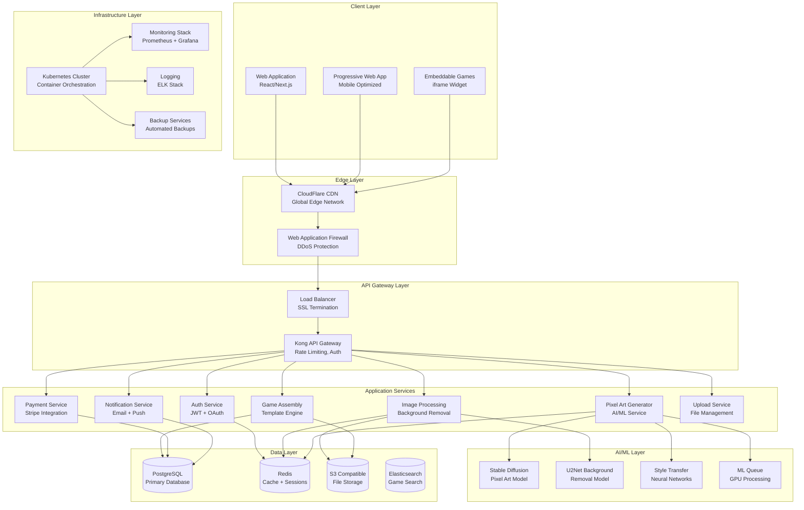
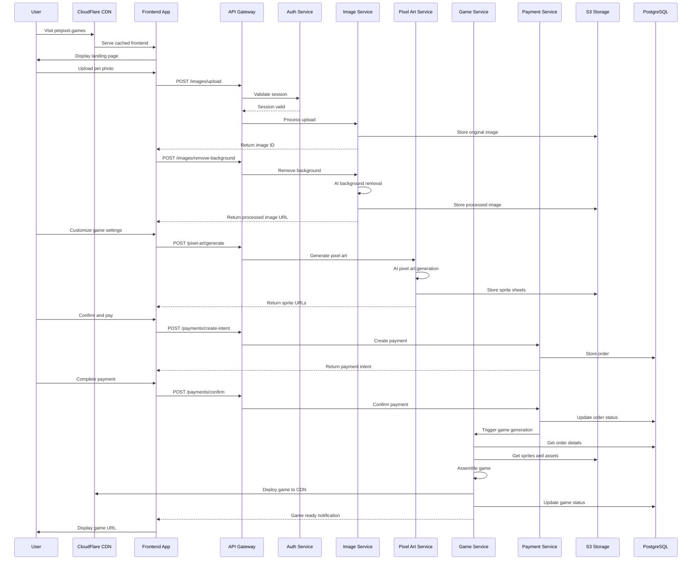
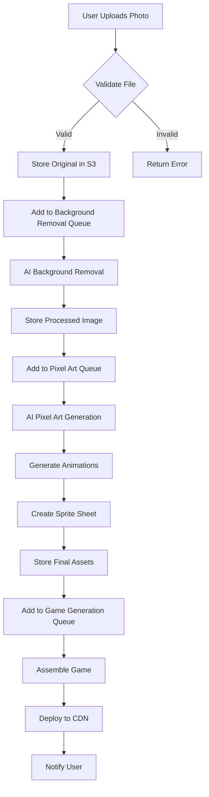

# System Architecture Document
## PetPixel Games Platform

**Document Version:** 1.0  
**Created:** 2025-01-20  
**Architect:** BMad Architect Agent  
**Dependencies:** PRD v1.0, Frontend Spec v1.0  
**Status:** Draft  

---

## 1. Architecture Overview

### 1.1 System Philosophy
- **Cloud-Native:** Microservices architecture with containerized deployment
- **AI-First:** Machine learning pipeline integrated throughout the platform
- **Scale-Ready:** Horizontal scaling from day one with auto-scaling capabilities
- **Security-First:** Zero-trust architecture with end-to-end encryption
- **Performance-Optimized:** Sub-3-second game generation with global CDN

### 1.2 High-Level Architecture



## 2. Service Architecture

### 2.1 Microservices Breakdown

#### 2.1.1 Authentication Service
```yaml
Service: auth-service
Purpose: Handle user authentication and authorization
Technology: Node.js + Express + Passport.js
Database: Redis (sessions), PostgreSQL (users)
Scaling: Stateless, horizontal scaling
Dependencies: None

Endpoints:
  POST /auth/register
  POST /auth/login
  POST /auth/logout
  POST /auth/refresh
  GET /auth/profile
  POST /auth/social/{provider}

Environment Variables:
  JWT_SECRET: "secure-secret-key"
  OAUTH_GOOGLE_CLIENT_ID: "google-oauth-id"
  OAUTH_FACEBOOK_CLIENT_ID: "facebook-oauth-id"
  SESSION_TTL: "7200" # 2 hours
```

#### 2.1.2 Image Processing Service
```yaml
Service: image-processing-service
Purpose: Handle photo upload, validation, and background removal
Technology: Node.js + Sharp + Python (AI models)
Database: S3 (storage), Redis (cache)
Scaling: CPU intensive, horizontal + GPU scaling
Dependencies: AI/ML models

Endpoints:
  POST /images/upload
  POST /images/remove-background
  POST /images/crop
  GET /images/{id}/status
  DELETE /images/{id}

Processing Pipeline:
  1. Validate upload (format, size, content)
  2. Generate thumbnails and preview
  3. Queue background removal job
  4. Store processed images in S3
  5. Cache results in Redis

Resource Requirements:
  CPU: 2-4 cores per instance
  Memory: 4-8 GB RAM
  Storage: 100 GB temporary processing
  GPU: Optional for faster AI processing
```

#### 2.1.3 Pixel Art Generation Service
```yaml
Service: pixel-art-service
Purpose: Convert photos to pixel art sprites and animations
Technology: Python + PyTorch + FastAPI
Database: S3 (models/assets), Redis (cache)
Scaling: GPU intensive, horizontal scaling
Dependencies: Stable Diffusion, Style Transfer models

Endpoints:
  POST /pixel-art/generate
  POST /pixel-art/animate
  GET /pixel-art/{id}/status
  GET /pixel-art/styles

AI Pipeline:
  1. Load fine-tuned Stable Diffusion model
  2. Apply img2img transformation
  3. Post-process for pixel art style
  4. Generate animation frames
  5. Create sprite sheet
  6. Optimize for web delivery

Resource Requirements:
  GPU: NVIDIA RTX 4090 or equivalent
  VRAM: 16+ GB for optimal performance
  CPU: 8+ cores for preprocessing
  Memory: 32 GB RAM
  Storage: 500 GB for models and cache
```

#### 2.1.4 Game Assembly Service
```yaml
Service: game-assembly-service
Purpose: Generate complete games from templates and assets
Technology: Node.js + Canvas API + Game Engine
Database: PostgreSQL (games), S3 (assets)
Scaling: CPU intensive, horizontal scaling
Dependencies: Pixel Art Service, Template Library

Endpoints:
  POST /games/create
  GET /games/{id}
  POST /games/{id}/regenerate
  GET /games/{id}/download

Game Generation Pipeline:
  1. Load game template by theme
  2. Inject custom sprites and assets
  3. Generate level layouts based on difficulty
  4. Compile game package (HTML5 + assets)
  5. Deploy to CDN
  6. Generate unique game URL

Template System:
  - Modular level templates in JSON
  - Physics configuration per theme
  - Enemy and collectible definitions
  - Scaling algorithms for difficulty
```

#### 2.1.5 Payment Service
```yaml
Service: payment-service
Purpose: Handle payments, subscriptions, and billing
Technology: Node.js + Stripe SDK
Database: PostgreSQL (orders, customers)
Scaling: Stateless, horizontal scaling
Dependencies: Notification Service

Endpoints:
  POST /payments/create-intent
  POST /payments/confirm
  POST /payments/refund
  GET /payments/history
  POST /subscriptions/create

Stripe Integration:
  - Payment Intents for one-time purchases
  - Subscriptions for recurring billing
  - Webhook handling for payment events
  - PCI compliance through Stripe
  - Multi-currency support

Security Features:
  - Payment data never stored locally
  - Stripe Elements for secure card input
  - 3D Secure authentication
  - Fraud detection integration
```

### 2.2 Database Design

#### 2.2.1 PostgreSQL Schema
```sql
-- Users and Authentication
CREATE TABLE users (
    id UUID PRIMARY KEY DEFAULT gen_random_uuid(),
    email VARCHAR(255) UNIQUE NOT NULL,
    name VARCHAR(255),
    avatar_url TEXT,
    provider VARCHAR(50), -- google, facebook, email
    provider_id VARCHAR(255),
    subscription_tier VARCHAR(50) DEFAULT 'free',
    subscription_status VARCHAR(50) DEFAULT 'inactive',
    credits_remaining INTEGER DEFAULT 0,
    created_at TIMESTAMP DEFAULT CURRENT_TIMESTAMP,
    updated_at TIMESTAMP DEFAULT CURRENT_TIMESTAMP
);

-- Game Orders and Billing
CREATE TABLE orders (
    id UUID PRIMARY KEY DEFAULT gen_random_uuid(),
    user_id UUID REFERENCES users(id),
    package_type VARCHAR(50) NOT NULL, -- basic, premium, subscription
    amount DECIMAL(10, 2) NOT NULL,
    currency VARCHAR(3) DEFAULT 'USD',
    status VARCHAR(50) DEFAULT 'pending', -- pending, completed, failed, refunded
    stripe_payment_intent_id VARCHAR(255),
    stripe_subscription_id VARCHAR(255),
    metadata JSONB,
    created_at TIMESTAMP DEFAULT CURRENT_TIMESTAMP,
    completed_at TIMESTAMP
);

-- Generated Games
CREATE TABLE games (
    id UUID PRIMARY KEY DEFAULT gen_random_uuid(),
    user_id UUID REFERENCES users(id),
    order_id UUID REFERENCES orders(id),
    short_code VARCHAR(12) UNIQUE NOT NULL, -- human-readable code
    title VARCHAR(255) NOT NULL,
    description TEXT,
    theme VARCHAR(50) NOT NULL, -- garden, house, beach, space, park
    difficulty VARCHAR(50) NOT NULL, -- easy, normal, hard
    level_count INTEGER NOT NULL,
    package_type VARCHAR(50) NOT NULL,
    game_url TEXT NOT NULL,
    download_url TEXT,
    thumbnail_url TEXT,
    config JSONB NOT NULL, -- game configuration
    assets JSONB, -- asset URLs and metadata
    stats JSONB DEFAULT '{}', -- play stats, shares, etc.
    status VARCHAR(50) DEFAULT 'generating', -- generating, ready, failed
    created_at TIMESTAMP DEFAULT CURRENT_TIMESTAMP,
    completed_at TIMESTAMP,
    expires_at TIMESTAMP -- for time-limited games
);

-- Pet Images and Processing
CREATE TABLE pet_images (
    id UUID PRIMARY KEY DEFAULT gen_random_uuid(),
    user_id UUID REFERENCES users(id),
    game_id UUID REFERENCES games(id),
    original_url TEXT NOT NULL,
    processed_url TEXT,
    background_removed_url TEXT,
    sprite_sheet_url TEXT,
    pet_name VARCHAR(255),
    processing_status VARCHAR(50) DEFAULT 'pending',
    metadata JSONB,
    created_at TIMESTAMP DEFAULT CURRENT_TIMESTAMP
);

-- Analytics and Usage Tracking
CREATE TABLE analytics_events (
    id BIGSERIAL PRIMARY KEY,
    user_id UUID,
    session_id UUID,
    game_id UUID,
    event_type VARCHAR(100) NOT NULL,
    event_data JSONB,
    user_agent TEXT,
    ip_address INET,
    referrer TEXT,
    created_at TIMESTAMP DEFAULT CURRENT_TIMESTAMP
);

-- Content Moderation
CREATE TABLE moderation_queue (
    id UUID PRIMARY KEY DEFAULT gen_random_uuid(),
    content_type VARCHAR(50), -- image, game, description
    content_id UUID,
    user_id UUID REFERENCES users(id),
    status VARCHAR(50) DEFAULT 'pending', -- pending, approved, rejected
    flagged_reason TEXT,
    reviewed_by UUID REFERENCES users(id),
    reviewed_at TIMESTAMP,
    notes TEXT,
    created_at TIMESTAMP DEFAULT CURRENT_TIMESTAMP
);

-- Create Indexes for Performance
CREATE INDEX idx_users_email ON users(email);
CREATE INDEX idx_users_provider ON users(provider, provider_id);
CREATE INDEX idx_orders_user_id ON orders(user_id);
CREATE INDEX idx_orders_status ON orders(status);
CREATE INDEX idx_games_user_id ON games(user_id);
CREATE INDEX idx_games_short_code ON games(short_code);
CREATE INDEX idx_games_status ON games(status);
CREATE INDEX idx_pet_images_game_id ON pet_images(game_id);
CREATE INDEX idx_analytics_events_user_id ON analytics_events(user_id);
CREATE INDEX idx_analytics_events_game_id ON analytics_events(game_id);
CREATE INDEX idx_analytics_events_created_at ON analytics_events(created_at);
CREATE INDEX idx_moderation_status ON moderation_queue(status);
```

#### 2.2.2 Redis Data Structures
```redis
# Session Management
session:{session_id} -> {user_data, expires_at}
TTL: 2 hours

# Image Processing Cache
image:processed:{image_id} -> {processed_url, metadata}
TTL: 24 hours

# Pixel Art Generation Cache
sprite:{sprite_id} -> {sprite_sheet_url, animations}
TTL: 7 days

# Rate Limiting
rate_limit:upload:{user_id} -> {count, reset_time}
TTL: 1 hour

rate_limit:api:{ip_address} -> {count, reset_time}
TTL: 15 minutes

# Game Generation Queue
queue:game_generation -> [{game_id, priority, created_at}]
queue:pixel_art -> [{image_id, style, created_at}]

# Real-time Game Stats
game:stats:{game_id} -> {views, plays, shares, completion_rate}
TTL: 30 days

# Popular Games Cache
popular:games:daily -> [game_ids...]
TTL: 1 hour

# User Game Library Cache
user:games:{user_id} -> [game_data...]
TTL: 1 hour
```

## 3. Infrastructure Architecture

### 3.1 Kubernetes Deployment
```yaml
# Namespace Configuration
apiVersion: v1
kind: Namespace
metadata:
  name: petgames-prod

---
# Frontend Deployment
apiVersion: apps/v1
kind: Deployment
metadata:
  name: frontend
  namespace: petgames-prod
spec:
  replicas: 3
  selector:
    matchLabels:
      app: frontend
  template:
    metadata:
      labels:
        app: frontend
    spec:
      containers:
      - name: frontend
        image: petgames/frontend:latest
        ports:
        - containerPort: 3000
        env:
        - name: NEXT_PUBLIC_API_URL
          value: "https://api.petpixel.games"
        - name: NEXT_PUBLIC_CDN_URL
          value: "https://cdn.petpixel.games"
        resources:
          requests:
            memory: "256Mi"
            cpu: "250m"
          limits:
            memory: "512Mi"
            cpu: "500m"
        livenessProbe:
          httpGet:
            path: /health
            port: 3000
          initialDelaySeconds: 30
          periodSeconds: 10

---
# Image Processing Service
apiVersion: apps/v1
kind: Deployment
metadata:
  name: image-processing
  namespace: petgames-prod
spec:
  replicas: 2
  selector:
    matchLabels:
      app: image-processing
  template:
    metadata:
      labels:
        app: image-processing
    spec:
      containers:
      - name: image-processing
        image: petgames/image-processing:latest
        ports:
        - containerPort: 3000
        env:
        - name: REDIS_URL
          valueFrom:
            secretKeyRef:
              name: redis-secret
              key: url
        - name: S3_BUCKET
          value: "petgames-assets"
        - name: REMOVE_BG_API_KEY
          valueFrom:
            secretKeyRef:
              name: ai-services-secret
              key: remove-bg-key
        resources:
          requests:
            memory: "2Gi"
            cpu: "1000m"
          limits:
            memory: "4Gi"
            cpu: "2000m"

---
# Pixel Art Service (GPU Required)
apiVersion: apps/v1
kind: Deployment
metadata:
  name: pixel-art-service
  namespace: petgames-prod
spec:
  replicas: 1
  selector:
    matchLabels:
      app: pixel-art-service
  template:
    metadata:
      labels:
        app: pixel-art-service
    spec:
      nodeSelector:
        gpu-type: "nvidia-rtx-4090"
      containers:
      - name: pixel-art-service
        image: petgames/pixel-art:latest
        ports:
        - containerPort: 8000
        env:
        - name: MODEL_PATH
          value: "/models"
        - name: CUDA_VISIBLE_DEVICES
          value: "0"
        resources:
          requests:
            memory: "16Gi"
            cpu: "4000m"
            nvidia.com/gpu: 1
          limits:
            memory: "32Gi"
            cpu: "8000m"
            nvidia.com/gpu: 1
        volumeMounts:
        - name: model-storage
          mountPath: /models
      volumes:
      - name: model-storage
        persistentVolumeClaim:
          claimName: ai-models-pvc

---
# Horizontal Pod Autoscaler
apiVersion: autoscaling/v2
kind: HorizontalPodAutoscaler
metadata:
  name: frontend-hpa
  namespace: petgames-prod
spec:
  scaleTargetRef:
    apiVersion: apps/v1
    kind: Deployment
    name: frontend
  minReplicas: 3
  maxReplicas: 10
  metrics:
  - type: Resource
    resource:
      name: cpu
      target:
        type: Utilization
        averageUtilization: 70
  - type: Resource
    resource:
      name: memory
      target:
        type: Utilization
        averageUtilization: 80
```

### 3.2 Network Architecture
```yaml
# Service Mesh with Istio
apiVersion: networking.istio.io/v1alpha3
kind: Gateway
metadata:
  name: petgames-gateway
spec:
  selector:
    istio: ingressgateway
  servers:
  - port:
      number: 443
      name: https
      protocol: HTTPS
    tls:
      mode: SIMPLE
      credentialName: petgames-tls
    hosts:
    - "petpixel.games"
    - "api.petpixel.games"

---
# Virtual Service for API Routing
apiVersion: networking.istio.io/v1alpha3
kind: VirtualService
metadata:
  name: api-routing
spec:
  hosts:
  - "api.petpixel.games"
  gateways:
  - petgames-gateway
  http:
  - match:
    - uri:
        prefix: "/auth"
    route:
    - destination:
        host: auth-service
        port:
          number: 3000
  - match:
    - uri:
        prefix: "/images"
    route:
    - destination:
        host: image-processing-service
        port:
          number: 3000
  - match:
    - uri:
        prefix: "/pixel-art"
    route:
    - destination:
        host: pixel-art-service
        port:
          number: 8000
  - match:
    - uri:
        prefix: "/games"
    route:
    - destination:
        host: game-assembly-service
        port:
          number: 3000
```

### 3.3 Security Architecture

#### 3.3.1 Zero-Trust Network Model
```yaml
# Network Policies
apiVersion: networking.k8s.io/v1
kind: NetworkPolicy
metadata:
  name: deny-all-default
  namespace: petgames-prod
spec:
  podSelector: {}
  policyTypes:
  - Ingress
  - Egress

---
# Allow Frontend to API Services
apiVersion: networking.k8s.io/v1
kind: NetworkPolicy
metadata:
  name: frontend-to-api
  namespace: petgames-prod
spec:
  podSelector:
    matchLabels:
      app: frontend
  policyTypes:
  - Egress
  egress:
  - to:
    - podSelector:
        matchLabels:
          tier: api
    ports:
    - protocol: TCP
      port: 3000
    - protocol: TCP
      port: 8000

---
# Service-to-Service Communication
apiVersion: networking.k8s.io/v1
kind: NetworkPolicy
metadata:
  name: api-internal-communication
  namespace: petgames-prod
spec:
  podSelector:
    matchLabels:
      tier: api
  policyTypes:
  - Ingress
  - Egress
  ingress:
  - from:
    - podSelector:
        matchLabels:
          app: frontend
    - podSelector:
        matchLabels:
          tier: api
  egress:
  - to:
    - podSelector:
        matchLabels:
          tier: database
```

#### 3.3.2 Secrets Management
```yaml
# Database Secrets
apiVersion: v1
kind: Secret
metadata:
  name: database-secret
  namespace: petgames-prod
type: Opaque
data:
  postgres-url: <base64-encoded-url>
  redis-url: <base64-encoded-url>

---
# AI Services Secrets
apiVersion: v1
kind: Secret
metadata:
  name: ai-services-secret
  namespace: petgames-prod
type: Opaque
data:
  remove-bg-key: <base64-encoded-key>
  openai-api-key: <base64-encoded-key>
  huggingface-token: <base64-encoded-token>

---
# Payment Secrets
apiVersion: v1
kind: Secret
metadata:
  name: payment-secret
  namespace: petgames-prod
type: Opaque
data:
  stripe-secret-key: <base64-encoded-key>
  stripe-webhook-secret: <base64-encoded-secret>
```

## 4. Data Flow Architecture

### 4.1 User Journey Data Flow


### 4.2 File Processing Pipeline


## 5. Monitoring and Observability

### 5.1 Monitoring Stack
```yaml
# Prometheus Configuration
apiVersion: v1
kind: ConfigMap
metadata:
  name: prometheus-config
data:
  prometheus.yml: |
    global:
      scrape_interval: 15s
      evaluation_interval: 15s
    
    rule_files:
      - "alerts/*.yml"
    
    scrape_configs:
    - job_name: 'kubernetes-pods'
      kubernetes_sd_configs:
      - role: pod
      relabel_configs:
      - source_labels: [__meta_kubernetes_pod_annotation_prometheus_io_scrape]
        action: keep
        regex: true
    
    - job_name: 'api-services'
      static_configs:
      - targets:
        - 'auth-service:3000'
        - 'image-processing-service:3000'
        - 'pixel-art-service:8000'
        - 'game-assembly-service:3000'
        - 'payment-service:3000'

---
# Grafana Dashboard ConfigMap
apiVersion: v1
kind: ConfigMap
metadata:
  name: grafana-dashboards
data:
  petgames-overview.json: |
    {
      "dashboard": {
        "title": "PetPixel Games Overview",
        "panels": [
          {
            "title": "Active Users",
            "type": "stat",
            "targets": [
              {
                "expr": "sum(rate(user_sessions_total[5m]))"
              }
            ]
          },
          {
            "title": "Game Generation Rate",
            "type": "graph",
            "targets": [
              {
                "expr": "rate(games_generated_total[5m])"
              }
            ]
          },
          {
            "title": "Payment Success Rate",
            "type": "stat",
            "targets": [
              {
                "expr": "rate(payments_successful_total[5m]) / rate(payments_attempted_total[5m]) * 100"
              }
            ]
          }
        ]
      }
    }
```

### 5.2 Alerting Rules
```yaml
# Alert Rules
apiVersion: v1
kind: ConfigMap
metadata:
  name: prometheus-alert-rules
data:
  alerts.yml: |
    groups:
    - name: petgames.rules
      rules:
      - alert: HighErrorRate
        expr: rate(http_requests_total{status=~"5.."}[5m]) / rate(http_requests_total[5m]) > 0.05
        for: 5m
        labels:
          severity: warning
        annotations:
          summary: "High error rate detected"
          description: "Error rate is {{ $value }}% for {{ $labels.service }}"
      
      - alert: GameGenerationSlow
        expr: histogram_quantile(0.95, rate(game_generation_duration_seconds_bucket[5m])) > 180
        for: 2m
        labels:
          severity: critical
        annotations:
          summary: "Game generation taking too long"
          description: "95th percentile game generation time is {{ $value }} seconds"
      
      - alert: PaymentServiceDown
        expr: up{job="payment-service"} == 0
        for: 1m
        labels:
          severity: critical
        annotations:
          summary: "Payment service is down"
          description: "Payment service has been down for more than 1 minute"
```

### 5.3 Logging Configuration
```yaml
# Fluentd Configuration
apiVersion: v1
kind: ConfigMap
metadata:
  name: fluentd-config
data:
  fluentd.conf: |
    <source>
      @type kubernetes_metadata
      @log_level info
    </source>
    
    <filter kubernetes.**>
      @type parser
      format json
      key_name log
      reserve_data true
    </filter>
    
    <match kubernetes.var.log.containers.**frontend**.log>
      @type elasticsearch
      host "elasticsearch-service"
      port 9200
      index_name frontend-logs
      type_name frontend
    </match>
    
    <match kubernetes.var.log.containers.**api**.log>
      @type elasticsearch
      host "elasticsearch-service"  
      port 9200
      index_name api-logs
      type_name api
    </match>
```

## 6. Security Implementation

### 6.1 Authentication & Authorization
```typescript
// JWT Token Structure
interface JWTPayload {
  sub: string;        // user ID
  email: string;      // user email
  tier: string;       // subscription tier
  permissions: string[]; // user permissions
  iat: number;        // issued at
  exp: number;        // expires at
  iss: string;        // issuer
}

// Auth Middleware
export const requireAuth = async (req: Request, res: Response, next: NextFunction) => {
  try {
    const token = req.headers.authorization?.split(' ')[1];
    
    if (!token) {
      return res.status(401).json({ error: 'No token provided' });
    }
    
    const payload = jwt.verify(token, process.env.JWT_SECRET!) as JWTPayload;
    
    // Check if user still exists and is active
    const user = await UserService.findById(payload.sub);
    if (!user || user.status !== 'active') {
      return res.status(401).json({ error: 'Invalid token' });
    }
    
    req.user = payload;
    next();
  } catch (error) {
    return res.status(401).json({ error: 'Invalid token' });
  }
};

// Permission-based Authorization
export const requirePermission = (permission: string) => {
  return (req: Request, res: Response, next: NextFunction) => {
    if (!req.user?.permissions.includes(permission)) {
      return res.status(403).json({ error: 'Insufficient permissions' });
    }
    next();
  };
};
```

### 6.2 Data Encryption
```typescript
// Encryption Service
import crypto from 'crypto';

export class EncryptionService {
  private static readonly algorithm = 'aes-256-gcm';
  private static readonly keyLength = 32;
  
  static encrypt(text: string, key: string): string {
    const iv = crypto.randomBytes(16);
    const hash = crypto.createHash('sha256').update(key).digest();
    const cipher = crypto.createCipher(this.algorithm, hash);
    
    let encrypted = cipher.update(text, 'utf8', 'hex');
    encrypted += cipher.final('hex');
    
    const authTag = cipher.getAuthTag();
    
    return iv.toString('hex') + ':' + authTag.toString('hex') + ':' + encrypted;
  }
  
  static decrypt(encryptedText: string, key: string): string {
    const [ivHex, authTagHex, encrypted] = encryptedText.split(':');
    
    const iv = Buffer.from(ivHex, 'hex');
    const authTag = Buffer.from(authTagHex, 'hex');
    const hash = crypto.createHash('sha256').update(key).digest();
    
    const decipher = crypto.createDecipher(this.algorithm, hash);
    decipher.setAuthTag(authTag);
    
    let decrypted = decipher.update(encrypted, 'hex', 'utf8');
    decrypted += decipher.final('utf8');
    
    return decrypted;
  }
}

// PII Data Encryption at Rest
export const encryptPII = (data: any): any => {
  const piiFields = ['email', 'name', 'phone', 'address'];
  const encrypted = { ...data };
  
  piiFields.forEach(field => {
    if (encrypted[field]) {
      encrypted[field] = EncryptionService.encrypt(
        encrypted[field], 
        process.env.PII_ENCRYPTION_KEY!
      );
    }
  });
  
  return encrypted;
};
```

### 6.3 Rate Limiting & DDoS Protection
```typescript
// Advanced Rate Limiting
import { RateLimiterRedis } from 'rate-limiter-flexible';

export class RateLimitService {
  private static uploadsLimiter = new RateLimiterRedis({
    storeClient: redisClient,
    keyPrefix: 'upload_limit',
    points: 10, // 10 uploads
    duration: 3600, // per hour
    blockDuration: 3600, // block for 1 hour
  });
  
  private static apiLimiter = new RateLimiterRedis({
    storeClient: redisClient,
    keyPrefix: 'api_limit',
    points: 100, // 100 requests
    duration: 60, // per minute
    blockDuration: 60, // block for 1 minute
  });
  
  static async checkUploadLimit(userId: string): Promise<void> {
    try {
      await this.uploadsLimiter.consume(userId);
    } catch (rejRes) {
      throw new Error(`Upload limit exceeded. Try again in ${Math.round(rejRes.msBeforeNext / 1000)} seconds`);
    }
  }
  
  static async checkAPILimit(ip: string): Promise<void> {
    try {
      await this.apiLimiter.consume(ip);
    } catch (rejRes) {
      throw new Error(`API limit exceeded. Try again in ${Math.round(rejRes.msBeforeNext / 1000)} seconds`);
    }
  }
}
```

## 7. Performance Optimization

### 7.1 Caching Strategy
```typescript
// Multi-level Caching
export class CacheService {
  // L1: In-memory cache for frequently accessed data
  private static memoryCache = new Map<string, { data: any, expires: number }>();
  
  // L2: Redis cache for distributed caching
  private static redisCache = redisClient;
  
  // L3: CDN cache for static assets
  private static cdnCache = 'https://cdn.petpixel.games';
  
  static async get(key: string): Promise<any> {
    // Check L1 cache first
    const memoryResult = this.memoryCache.get(key);
    if (memoryResult && memoryResult.expires > Date.now()) {
      return memoryResult.data;
    }
    
    // Check L2 cache
    const redisResult = await this.redisCache.get(key);
    if (redisResult) {
      const data = JSON.parse(redisResult);
      // Update L1 cache
      this.memoryCache.set(key, {
        data,
        expires: Date.now() + 300000 // 5 minutes
      });
      return data;
    }
    
    return null;
  }
  
  static async set(key: string, data: any, ttl: number = 3600): Promise<void> {
    // Set in both L1 and L2
    this.memoryCache.set(key, {
      data,
      expires: Date.now() + Math.min(ttl * 1000, 300000)
    });
    
    await this.redisCache.setex(key, ttl, JSON.stringify(data));
  }
}

// CDN Cache Headers
export const setCDNCacheHeaders = (res: Response, maxAge: number) => {
  res.set({
    'Cache-Control': `public, max-age=${maxAge}, s-maxage=${maxAge}`,
    'Expires': new Date(Date.now() + maxAge * 1000).toUTCString(),
    'Last-Modified': new Date().toUTCString(),
    'ETag': `"${crypto.createHash('md5').update(res.body || '').digest('hex')}"`
  });
};
```

### 7.2 Database Optimization
```sql
-- Connection Pooling Configuration
-- PostgreSQL Connection Pool: 20 connections per service instance
-- Read Replicas for Analytics Queries

-- Optimized Queries with Proper Indexing
-- Games Gallery Query (Most Performance Critical)
CREATE INDEX CONCURRENTLY idx_games_featured 
ON games(created_at DESC, status) 
WHERE status = 'ready' AND featured = true;

-- User Games Library Query  
CREATE INDEX CONCURRENTLY idx_user_games_recent
ON games(user_id, created_at DESC)
WHERE status = 'ready';

-- Analytics Query Optimization
CREATE INDEX CONCURRENTLY idx_analytics_time_series
ON analytics_events(created_at, event_type)
WHERE created_at >= CURRENT_DATE - INTERVAL '30 days';

-- Partitioning for Analytics Table
CREATE TABLE analytics_events_y2024m01 
PARTITION OF analytics_events
FOR VALUES FROM ('2024-01-01') TO ('2024-02-01');

-- Database Connection Pool Settings
{
  "host": "postgres-primary",
  "port": 5432,
  "database": "petgames",
  "user": "api_user",
  "password": "${DB_PASSWORD}",
  "pool": {
    "min": 5,
    "max": 20,
    "acquireTimeoutMillis": 60000,
    "createTimeoutMillis": 30000,
    "destroyTimeoutMillis": 5000,
    "idleTimeoutMillis": 300000,
    "reapIntervalMillis": 1000,
    "createRetryIntervalMillis": 200
  },
  "readReplicas": [
    {
      "host": "postgres-read-replica-1",
      "port": 5432
    }
  ]
}
```

## 8. Deployment Strategy

### 8.1 CI/CD Pipeline
```yaml
# GitHub Actions Workflow
name: Deploy to Production

on:
  push:
    branches: [main]

jobs:
  test:
    runs-on: ubuntu-latest
    steps:
    - uses: actions/checkout@v3
    
    - name: Setup Node.js
      uses: actions/setup-node@v3
      with:
        node-version: '18'
        cache: 'npm'
    
    - name: Install dependencies
      run: npm ci
    
    - name: Run tests
      run: npm run test:coverage
    
    - name: Run linting
      run: npm run lint
    
    - name: Security audit
      run: npm audit --audit-level high

  build:
    needs: test
    runs-on: ubuntu-latest
    steps:
    - uses: actions/checkout@v3
    
    - name: Build Docker images
      run: |
        docker build -t petgames/frontend:${{ github.sha }} ./frontend
        docker build -t petgames/api:${{ github.sha }} ./backend
        docker build -t petgames/pixel-art:${{ github.sha }} ./ai-services
    
    - name: Push to registry
      run: |
        echo ${{ secrets.DOCKER_PASSWORD }} | docker login -u ${{ secrets.DOCKER_USERNAME }} --password-stdin
        docker push petgames/frontend:${{ github.sha }}
        docker push petgames/api:${{ github.sha }}
        docker push petgames/pixel-art:${{ github.sha }}

  deploy:
    needs: build
    runs-on: ubuntu-latest
    steps:
    - name: Deploy to Kubernetes
      run: |
        kubectl set image deployment/frontend frontend=petgames/frontend:${{ github.sha }}
        kubectl set image deployment/api-services api=petgames/api:${{ github.sha }}
        kubectl set image deployment/pixel-art-service pixel-art=petgames/pixel-art:${{ github.sha }}
        kubectl rollout status deployment/frontend
        kubectl rollout status deployment/api-services
        kubectl rollout status deployment/pixel-art-service
```

### 8.2 Blue-Green Deployment
```yaml
# Blue-Green Deployment Strategy
apiVersion: argoproj.io/v1alpha1
kind: Rollout
metadata:
  name: frontend-rollout
spec:
  replicas: 5
  strategy:
    blueGreen:
      activeService: frontend-active
      previewService: frontend-preview
      autoPromotionEnabled: false
      scaleDownDelaySeconds: 30
      prePromotionAnalysis:
        templates:
        - templateName: success-rate
        args:
        - name: service-name
          value: frontend-preview
      postPromotionAnalysis:
        templates:
        - templateName: success-rate
        args:
        - name: service-name
          value: frontend-active
  selector:
    matchLabels:
      app: frontend
  template:
    metadata:
      labels:
        app: frontend
    spec:
      containers:
      - name: frontend
        image: petgames/frontend:latest
```

---

**Document Status:** Ready for QA Review  
**Next Steps:** QA Agent to perform Early Test Architecture Input  
**Critical Dependencies:** AI model availability, GPU infrastructure  
**Security Review:** Required before production deployment