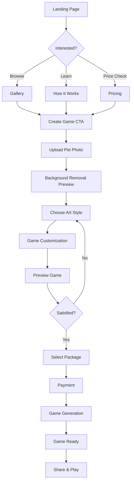

# Frontend Specification
## PetPixel Games Platform

**Document Version:** 1.0  
**Created:** 2025-01-20  
**UX Expert:** BMad UX Agent  
**Dependencies:** PRD v1.0  
**Status:** Draft  

---

## 1. Design Philosophy

### 1.1 Design Principles
- **Pet-Centric:** Every element celebrates the bond between pets and owners
- **Instant Delight:** Immediate visual feedback and progress indicators
- **Nostalgic Charm:** Retro gaming aesthetic with modern usability
- **Trust & Security:** Clear value proposition with trustworthy design
- **Mobile-First:** Optimized for mobile devices where pet photos are taken

### 1.2 Brand Guidelines
- **Color Palette:** Warm, friendly colors with pixel art accent colors
- **Typography:** Modern sans-serif with pixel art headings for games
- **Imagery:** High-quality pet photos, pixel art examples, retro gaming elements
- **Voice & Tone:** Friendly, enthusiastic, encouraging, professional

## 2. Information Architecture

### 2.1 Site Structure
```
Landing Page
├── How It Works
├── Gallery (Examples)
├── Pricing
└── Create Game
    ├── Upload Photos
    ├── Choose Style
    ├── Customize Game
    ├── Preview
    ├── Payment
    └── Game Ready
```

### 2.2 User Flow Diagram


## 3. Page-by-Page Specifications

### 3.1 Landing Page

#### 3.1.1 Hero Section
```
┌─────────────────────────────────────────────────┐
│                    HEADER                       │
│  [Logo] [How It Works] [Gallery] [Pricing] [▶] │
├─────────────────────────────────────────────────┤
│                                                 │
│  Turn Your Pet Into a           [Demo Video]   │
│  Retro Game Hero! 🎮           [Auto-playing]  │
│                                 [Muted, Loop]   │
│  Create personalized games      [Cat→Pixel→Game│
│  featuring your beloved pets    │ Transformation]│
│  in under 3 minutes!           [480x320px]     │
│                                                 │
│  [🎮 Create My Pet's Game] [$14.99 starts]     │
│  [👀 See Examples First]                       │
└─────────────────────────────────────────────────┘
```

**Key Elements:**
- **Headline:** Clear value proposition with emotional appeal
- **Demo Video:** 30-second transformation showing photo→pixel art→gameplay
- **Primary CTA:** Prominent "Create My Pet's Game" button
- **Secondary CTA:** Low-commitment "See Examples" for hesitant users
- **Price Anchor:** Starting price visibility builds trust

#### 3.1.2 How It Works Section
```
┌─────────────────────────────────────────────────┐
│              How It Works (3 Simple Steps)     │
├─────────────────────────────────────────────────┤
│  1️⃣ Upload Photo     2️⃣ Customize Game    3️⃣ Play & Share │
│  [Pet Photo Icon]    [Game Controller]    [Share Icon]   │
│  Upload your pet's   Choose theme, diff-  Get unique URL │
│  favorite photo.     iculty, and powers.  to play & share │
│  We handle the rest! AI creates your game  with friends!  │
│                      in minutes.                         │
├─────────────────────────────────────────────────┤
│           [🚀 Start Creating] [⏱️ Under 3 Minutes]        │
└─────────────────────────────────────────────────┘
```

#### 3.1.3 Social Proof Section
```
┌─────────────────────────────────────────────────┐
│              Loved by Pet Parents               │
├─────────────────────────────────────────────────┤
│  ⭐⭐⭐⭐⭐ "Amazing! My cat Luna looks perfect  │
│  in pixel form. My kids love playing it!"      │
│  - Sarah M., Dog Mom                            │
│                                                 │
│  📊 [2,847 Games Created] [98% Happy Customers] │
│  📊 [4.9/5 Rating] [Featured on ProductHunt]   │
└─────────────────────────────────────────────────┘
```

#### 3.1.4 Example Gallery Preview
```
┌─────────────────────────────────────────────────┐
│                  See Examples                   │
├─────────────────────────────────────────────────┤
│  [Before→After Grid]                           │
│  Real Pet Photo | Pixel Art | Game Screenshot  │
│  [Golden Retriever] [Pixel Dog] [Game Level]   │
│  [Tabby Cat]     [Pixel Cat]   [Cat Jumping]   │
│  [Rabbit]        [Pixel Bunny] [Carrot Level]  │
│                                                 │
│  [🎮 Try It With My Pet] [👀 See Full Gallery] │
└─────────────────────────────────────────────────┘
```

### 3.2 Game Creation Flow

#### 3.2.1 Photo Upload Page
```
┌─────────────────────────────────────────────────┐
│  [Progress: ●○○○○○] Step 1 of 6: Upload Photo   │
├─────────────────────────────────────────────────┤
│                                                 │
│  📸 Upload Your Pet's Best Photo                │
│                                                 │
│  ┌─────────────────────────────────────────┐   │
│  │                                         │   │
│  │        [📷 Upload Photo]                │   │
│  │        [📱 Take Photo]                  │   │
│  │                                         │   │
│  │  Drag & drop or click to upload        │   │
│  │                                         │   │
│  │  ✅ JPEG, PNG, HEIC up to 10MB          │   │
│  │  ✅ Best results: Clear face, good light│   │
│  │  ✅ We'll remove background automatically│   │
│  └─────────────────────────────────────────┘   │
│                                                 │
│  💡 Tip: Use a photo where your pet's face     │
│      is clearly visible for best results!      │
│                                                 │
│  [← Back] [Continue →] (disabled until upload) │
└─────────────────────────────────────────────────┘
```

#### 3.2.2 Background Removal Preview
```
┌─────────────────────────────────────────────────┐
│  [Progress: ●●○○○○] Step 2 of 6: Preview        │
├─────────────────────────────────────────────────┤
│                                                 │
│  🎨 Background Removed! Looking Good?           │
│                                                 │
│  Before              After                      │
│  ┌─────────────┐    ┌─────────────┐            │
│  │[Original    │    │[Pet with    │            │
│  │ with back-  │    │ transparent │            │
│  │ ground]     │ →  │ background] │            │
│  │             │    │             │            │
│  └─────────────┘    └─────────────┘            │
│                                                 │
│  [🔄 Retake Photo] [✂️ Adjust Edges] [✅ Looks Good] │
│                                                 │
│  Pet's Name: [_Luna____________] (Optional)     │
│                                                 │
│  [← Back] [Continue →]                          │
└─────────────────────────────────────────────────┘
```

#### 3.2.3 Art Style Selection
```
┌─────────────────────────────────────────────────┐
│  [Progress: ●●●○○○] Step 3 of 6: Choose Style   │
├─────────────────────────────────────────────────┤
│                                                 │
│  🎨 Choose Your Pixel Art Style                 │
│                                                 │
│  ┌───────────┐ ┌───────────┐ ┌───────────┐     │
│  │  8-Bit    │ │  16-Bit   │ │  Modern   │     │
│  │ Classic   │ │   SNES    │ │   Indie   │     │
│  │[Preview]  │ │[Preview]  │ │[Preview]  │     │
│  │    ●      │ │     ○     │ │     ○     │     │
│  └───────────┘ └───────────┘ └───────────┘     │
│                                                 │
│  Preview: Your pet as [Selected Style]         │
│  ┌─────────────────────────────────────────┐   │
│  │ [Animated sprite preview of pet]        │   │
│  │ [Idle, Walk, Jump animations]           │   │
│  └─────────────────────────────────────────┘   │
│                                                 │
│  [← Back] [Continue →]                          │
└─────────────────────────────────────────────────┘
```

#### 3.2.4 Game Customization
```
┌─────────────────────────────────────────────────┐
│  [Progress: ●●●●○○] Step 4 of 6: Customize      │
├─────────────────────────────────────────────────┤
│                                                 │
│  🎮 Customize Your Pet's Adventure              │
│                                                 │
│  World Theme:                                   │
│  ┌─────┐ ┌─────┐ ┌─────┐ ┌─────┐ ┌─────┐     │
│  │Garden│ │House│ │Beach│ │Space│ │Park │     │
│  │  ●  │ │  ○  │ │  ○  │ │  ○  │ │  ○  │     │
│  └─────┘ └─────┘ └─────┘ └─────┘ └─────┘     │
│                                                 │
│  Difficulty: ○ Easy  ●Normal  ○ Challenge       │
│  Levels: ○ 3  ●5  ○ 7  ○ 10                   │
│                                                 │
│  Special Powers (choose 2):                    │
│  ☑️ Double Jump  ☑️ Speed Boost  ☐ Glide       │
│  ☐ Wall Climb   ☐ Super Strength ☐ Teleport   │
│                                                 │
│  Describe your pet's personality (optional):    │
│  ┌─────────────────────────────────────────┐   │
│  │ Luna loves exploring and chasing        │   │
│  │ butterflies in the garden...            │   │
│  └─────────────────────────────────────────┘   │
│                                                 │
│  [← Back] [Continue →]                          │
└─────────────────────────────────────────────────┘
```

#### 3.2.5 Preview & Package Selection
```
┌─────────────────────────────────────────────────┐
│  [Progress: ●●●●●○] Step 5 of 6: Preview        │
├─────────────────────────────────────────────────┤
│                                                 │
│  🎬 Preview Your Game                           │
│                                                 │
│  ┌─────────────────────────────────────────┐   │
│  │ [Live game preview window]              │   │
│  │ [Luna the pixel cat jumping in garden] │   │
│  │ [▶️ Play Preview] [Restart] [Fullscreen]│   │
│  └─────────────────────────────────────────┘   │
│                                                 │
│  Choose Your Package:                           │
│                                                 │
│  ┌─────────────┐ ┌─────────────┐               │
│  │   Basic     │ │  Premium    │               │
│  │   $14.99    │ │   $24.99    │               │
│  │             │ │             │               │
│  │ • 5 Levels  │ │ • 10 Levels │               │
│  │ • Download  │ │ • Download  │               │
│  │ • Share URL │ │ • Share URL │               │
│  │     ○       │ │ • HD Assets │               │
│  │             │ │ • Boss Level│               │
│  │             │ │     ●       │               │
│  └─────────────┘ └─────────────┘               │
│                                                 │
│  [← Back & Edit] [Continue to Payment →]       │
└─────────────────────────────────────────────────┘
```

#### 3.2.6 Payment Page
```
┌─────────────────────────────────────────────────┐
│  [Progress: ●●●●●●] Step 6 of 6: Payment        │
├─────────────────────────────────────────────────┤
│                                                 │
│  💳 Secure Checkout                             │
│                                                 │
│  Order Summary:                                 │
│  ┌─────────────────────────────────────────┐   │
│  │ Premium Pet Game - "Luna's Adventure"   │   │
│  │ • 10 Levels in Garden Theme            │   │
│  │ • HD Pixel Art Style                   │   │
│  │ • Download + Share                     │   │
│  │                           $24.99       │   │
│  │                                        │   │
│  │ 🎁 Gift this game? [Toggle Switch]     │   │
│  └─────────────────────────────────────────┘   │
│                                                 │
│  Payment Method:                                │
│  [💳 Credit Card] [PayPal] [Apple Pay] [Google Pay] │
│                                                 │
│  [Card Number Field]                            │
│  [Exp] [CVC] [ZIP]                             │
│                                                 │
│  🔒 Secure SSL Encryption • 30-Day Guarantee   │
│                                                 │
│  [← Back] [💳 Complete Purchase $24.99]        │
└─────────────────────────────────────────────────┘
```

#### 3.2.7 Generation Status
```
┌─────────────────────────────────────────────────┐
│  🎮 Creating Luna's Game Magic! ✨              │
├─────────────────────────────────────────────────┤
│                                                 │
│  ┌─────────────────────────────────────────┐   │
│  │ [Animated spinner with pixel art style] │   │
│  │                                         │   │
│  │     Creating your personalized game...  │   │
│  │                                         │   │
│  │     ████████████░░░░ 75%                │   │
│  │                                         │   │
│  │     Estimated time: 45 seconds          │   │
│  └─────────────────────────────────────────┘   │
│                                                 │
│  Progress:                                      │
│  ✅ Processing Luna's photo                     │
│  ✅ Creating pixel art sprites                  │
│  ✅ Generating garden levels                    │
│  🔄 Adding sound effects                       │
│  ⏳ Final optimization                         │
│                                                 │
│  💡 Fun Fact: Did you know cats have 32        │
│     muscles in each ear? 🐱                    │
│                                                 │
│  📧 We'll email you when it's ready!           │
└─────────────────────────────────────────────────┘
```

#### 3.2.8 Game Ready Page
```
┌─────────────────────────────────────────────────┐
│  🎉 Luna's Adventure is Ready! 🎉              │
├─────────────────────────────────────────────────┤
│                                                 │
│  ┌─────────────────────────────────────────┐   │
│  │ [Game thumbnail screenshot]             │   │
│  │ "Luna's Garden Adventure"               │   │
│  │ 10 levels • Premium • Ready to play    │   │
│  └─────────────────────────────────────────┘   │
│                                                 │
│  Your Game URL:                                 │
│  ┌─────────────────────────────────────────┐   │
│  │ petpixel.games/play/luna-adventure-abc12│   │
│  │                              [Copy] 📋  │   │
│  └─────────────────────────────────────────┘   │
│                                                 │
│  [🎮 Play Now!] [📱 Share] [💾 Download]       │
│                                                 │
│  Share with friends:                            │
│  [Facebook] [Instagram] [Twitter] [Email]      │
│                                                 │
│  QR Code for mobile:                           │
│  ┌─────────┐                                   │
│  │ [QR]    │  📧 Game link sent to your email  │
│  │ [CODE]  │     for safekeeping!              │
│  └─────────┘                                   │
│                                                 │
│  [🌟 Rate Your Experience] [🎮 Create Another]  │
└─────────────────────────────────────────────────┘
```

### 3.3 Responsive Design Specifications

#### 3.3.1 Mobile Breakpoints
- **Mobile:** 320px - 768px
- **Tablet:** 768px - 1024px  
- **Desktop:** 1024px+

#### 3.3.2 Mobile-Specific Optimizations
```
Mobile Layout Changes:
├── Stack hero content vertically
├── Compress navigation to hamburger menu
├── Enlarge touch targets (44px minimum)
├── Simplify customization to presets
├── Single-column layout for all content
└── Camera-first photo upload flow
```

#### 3.3.3 Tablet Optimizations
```
Tablet Layout Changes:
├── Two-column layout where appropriate
├── Larger preview windows
├── Side-by-side comparisons
├── Touch-friendly controls
└── Landscape gaming mode
```

## 4. Component Library

### 4.1 Core Components

#### 4.1.1 Button System
```
Primary CTA: [🎮 Create My Pet's Game]
- Background: Gradient (orange to red)
- Text: White, bold, 18px
- Border-radius: 8px
- Hover: Subtle scale (1.05x)
- Icon: Gaming controller emoji

Secondary CTA: [👀 See Examples First]
- Background: Transparent
- Border: 2px solid primary color
- Text: Primary color, medium, 16px
- Hover: Fill with primary color

Tertiary: [← Back] [Continue →]
- Background: Light gray
- Text: Dark gray, medium, 14px
- Minimal hover effect
```

#### 4.1.2 Progress Indicator
```
Step Progress: [●●●○○○] Step 3 of 6
- Filled dots: Primary color
- Empty dots: Light gray
- Current step highlighted
- Step description included
```

#### 4.1.3 Upload Component
```
Drag & Drop Zone:
┌─────────────────────────────────┐
│           [📷 Icon]             │
│        Upload Photo             │
│                                 │
│   Drag & drop or click          │
│                                 │
│   ✅ JPEG, PNG, HEIC up to 10MB │
└─────────────────────────────────┘

States:
- Default: Dashed border, light background
- Hover: Solid border, highlighted background  
- Uploading: Progress bar, spinner
- Success: Green border, checkmark
- Error: Red border, error message
```

#### 4.1.4 Preview Card
```
Game Preview Card:
┌─────────────────────────────────┐
│        [Screenshot]             │
│                                 │
│  "Luna's Garden Adventure"      │
│  10 levels • Premium            │
│                                 │
│  [▶️ Play] [👀 Preview] [📱 Share] │
└─────────────────────────────────┘
```

### 4.2 Interactive Elements

#### 4.2.1 Style Selector
```
Radio Button Group - Art Styles:
┌─────────┐ ┌─────────┐ ┌─────────┐
│ 8-Bit   │ │ 16-Bit  │ │ Modern  │
│[Preview]│ │[Preview]│ │[Preview]│
│    ●    │ │    ○    │ │    ○    │
│Selected │ │Available│ │Available│
└─────────┘ └─────────┘ └─────────┘

Selected State:
- Border: 3px solid primary color
- Shadow: Subtle glow
- Checkmark overlay

Available State:
- Border: 1px solid light gray
- Hover: Border becomes primary color
```

#### 4.2.2 Package Selector
```
Package Cards:
┌─────────────┐ ┌─────────────┐
│   Basic     │ │  Premium    │
│   $14.99    │ │   $24.99    │
│             │ │             │
│ • 5 Levels  │ │ • 10 Levels │
│ • Download  │ │ • Download  │
│ • Share URL │ │ • Share URL │
│     ○       │ │ • HD Assets │
│             │ │ • Boss Level│
│             │ │     ●       │
└─────────────┘ └─────────────┘

Selected Package:
- Background: Light primary color
- Border: Primary color
- Scale: Slightly larger (1.02x)
- Badge: "MOST POPULAR" if applicable
```

## 5. Design System

### 5.1 Color Palette
```css
/* Primary Colors */
--primary-orange: #FF6B35;
--primary-red: #E55D00;
--primary-yellow: #FFD23F;

/* Secondary Colors */
--secondary-blue: #4ECDC4;
--secondary-purple: #9B59B6;
--secondary-green: #2ECC71;

/* Neutral Colors */
--neutral-900: #2C3E50;  /* Dark text */
--neutral-700: #34495E;  /* Medium text */
--neutral-500: #7F8C8D;  /* Light text */
--neutral-300: #BDC3C7;  /* Borders */
--neutral-100: #ECF0F1;  /* Light backgrounds */
--neutral-50: #F8F9FA;   /* Very light backgrounds */

/* Semantic Colors */
--success: #27AE60;
--warning: #F39C12;
--error: #E74C3C;
--info: #3498DB;
```

### 5.2 Typography
```css
/* Font Families */
--font-primary: 'Inter', sans-serif;      /* Body text */
--font-gaming: 'Press Start 2P', monospace; /* Gaming elements */
--font-headings: 'Poppins', sans-serif;   /* Headlines */

/* Font Scales */
--text-xs: 12px;    /* Captions */
--text-sm: 14px;    /* Small text */
--text-base: 16px;  /* Body text */
--text-lg: 18px;    /* Large text */
--text-xl: 20px;    /* Small headlines */
--text-2xl: 24px;   /* Medium headlines */
--text-3xl: 30px;   /* Large headlines */
--text-4xl: 36px;   /* Hero headlines */
```

### 5.3 Spacing System
```css
/* Spacing Scale */
--space-1: 4px;
--space-2: 8px;
--space-3: 12px;
--space-4: 16px;
--space-5: 20px;
--space-6: 24px;
--space-8: 32px;
--space-10: 40px;
--space-12: 48px;
--space-16: 64px;
--space-20: 80px;
--space-24: 96px;
```

### 5.4 Animation & Transitions
```css
/* Standard Transitions */
--transition-fast: 150ms ease-out;
--transition-normal: 250ms ease-out;
--transition-slow: 400ms ease-out;

/* Hover Effects */
.button-hover {
  transform: translateY(-2px);
  box-shadow: 0 4px 12px rgba(0,0,0,0.15);
}

.card-hover {
  transform: translateY(-4px);
  box-shadow: 0 8px 25px rgba(0,0,0,0.1);
}

/* Loading Animations */
@keyframes pulse {
  0%, 100% { opacity: 1; }
  50% { opacity: 0.5; }
}

@keyframes spin {
  from { transform: rotate(0deg); }
  to { transform: rotate(360deg); }
}
```

## 6. Accessibility Specifications

### 6.1 WCAG 2.1 AA Compliance
- **Color Contrast:** Minimum 4.5:1 for normal text, 3:1 for large text
- **Keyboard Navigation:** All interactive elements accessible via keyboard
- **Screen Readers:** Proper ARIA labels and semantic HTML
- **Focus Indicators:** Visible focus states for all interactive elements

### 6.2 Accessibility Features
```html
<!-- Image Upload with Screen Reader Support -->
<div role="button" tabindex="0" aria-label="Upload pet photo">
  <input type="file" id="pet-photo" class="sr-only" />
  <label for="pet-photo">
    <span aria-hidden="true">📷</span>
    Upload Photo
  </label>
</div>

<!-- Progress Indicator -->
<div role="progressbar" aria-valuenow="3" aria-valuemin="1" aria-valuemax="6">
  Step 3 of 6: Choose Style
</div>

<!-- Form Validation -->
<input aria-invalid="true" aria-describedby="email-error" />
<div id="email-error" role="alert">
  Please enter a valid email address
</div>
```

### 6.3 Mobile Accessibility
- **Touch Targets:** Minimum 44x44px for interactive elements
- **Voice Control:** Support for voice input on mobile devices
- **Reduced Motion:** Respect prefers-reduced-motion settings
- **High Contrast:** Support for high contrast mode

## 7. Performance Specifications

### 7.1 Loading Performance
- **Initial Page Load:** < 2 seconds on 3G
- **Image Processing:** Progress indicators for operations > 3 seconds
- **Lazy Loading:** Progressive image loading for gallery pages
- **Code Splitting:** Route-based code splitting for optimal bundles

### 7.2 Image Optimization
- **WebP Support:** Modern format with JPEG fallback
- **Responsive Images:** Multiple sizes served based on device
- **Compression:** Automatic compression maintaining quality
- **CDN Delivery:** Global content delivery network

### 7.3 Interactive Performance
- **60 FPS:** Smooth animations and transitions
- **Debounced Input:** Prevent excessive API calls during typing
- **Optimistic Updates:** Immediate UI feedback before server response
- **Error Recovery:** Graceful handling of network failures

## 8. Technical Implementation Notes

### 8.1 Frontend Framework
- **React 18+** with Next.js for SSR/SSG
- **TypeScript** for type safety
- **Tailwind CSS** for styling system
- **Framer Motion** for animations

### 8.2 State Management
- **Zustand** for global state (lightweight)
- **React Hook Form** for form management
- **SWR** for data fetching and caching

### 8.3 Testing Strategy
- **Jest** for unit testing
- **Cypress** for E2E testing
- **Storybook** for component documentation
- **Accessibility testing** with axe-core

---

**Document Status:** Ready for Architecture Review  
**Next Steps:** Architect to create system architecture incorporating UX requirements  
**Dependencies:** None (UX spec is complete)  
**Review Required:** UI/UX team approval before development begins