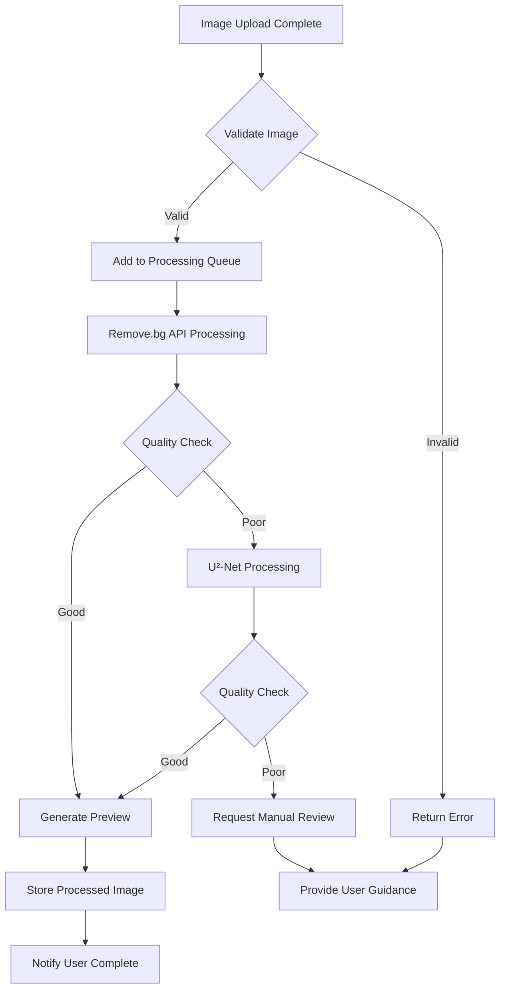

# Story E001.2: Background Removal Service
## PetPixel Games Platform

**Story ID:** E001.2  
**Story Title:** Background Removal Service  
**Epic:** E001 - Image Processing Pipeline  
**Priority:** P0 (Must Have)  
**Story Points:** 13  
**Sprint:** Sprint 1-2  

---

## User Story

**As a** pet owner  
**I want** the background automatically removed from my pet's photo  
**So that** my pet can be seamlessly integrated into the pixel art game world  

## Business Context

Background removal is critical for creating clean pixel art sprites. The service must achieve high accuracy (>90%) while handling diverse photo conditions, lighting situations, and pet breeds. This directly impacts the final game quality and user satisfaction.

## Acceptance Criteria

### AC-1: Automatic Background Removal
- [ ] **Given** I have uploaded a pet photo, **when** background removal processes, **then** the pet is cleanly separated from the background
- [ ] **Given** the photo has a complex background, **when** processing completes, **then** the pet edges are preserved accurately
- [ ] **Given** the pet has fluffy or transparent fur, **when** removal processes, **then** fur details are maintained

### AC-2: Quality Assessment and Validation
- [ ] **Given** background removal completes, **when** quality is assessed, **then** the system provides a confidence score
- [ ] **Given** the confidence score is below threshold, **when** assessment fails, **then** alternative processing is attempted
- [ ] **Given** all processing attempts fail, **when** no acceptable result exists, **then** user is guided to upload a better photo

### AC-3: Preview and Approval Workflow
- [ ] **Given** background removal succeeds, **when** I view the result, **then** I see before/after comparison
- [ ] **Given** I review the processed image, **when** the result looks good, **then** I can approve and continue
- [ ] **Given** the result needs improvement, **when** I request adjustment, **then** I can access manual refinement tools

### AC-4: Multiple Pet Detection and Handling
- [ ] **Given** my photo contains multiple pets, **when** processing occurs, **then** the system detects and highlights this
- [ ] **Given** multiple subjects are detected, **when** I need to choose, **then** I can select which pet to use as the main character
- [ ] **Given** I select the primary pet, **when** processing continues, **then** only the selected pet is processed

### AC-5: Edge Case Handling
- [ ] **Given** my photo has poor lighting, **when** processing occurs, **then** the system attempts enhancement before removal
- [ ] **Given** the pet blends with the background, **when** standard processing fails, **then** enhanced models are used
- [ ] **Given** the photo quality is too poor, **when** processing cannot succeed, **then** I receive specific guidance for improvement

### AC-6: Processing Performance and Reliability
- [ ] **Given** I submit a photo for processing, **when** the service processes, **then** completion occurs within 10 seconds
- [ ] **Given** the service is under load, **when** multiple requests process, **then** each maintains quality and speed
- [ ] **Given** the primary AI service fails, **when** failure occurs, **then** fallback services maintain functionality

## Technical Requirements

### AI Service Integration
```yaml
Primary Service: Remove.bg API
- API Key: Secured in environment variables
- Rate Limits: Monitored with circuit breaker
- Quality: "animal" type specification
- Size: "preview" for speed, "full" for final

Fallback Service: U²-Net Local Model
- Model: Hosted on GPU infrastructure
- Quality: Comparable to Remove.bg
- Latency: Slightly higher but more reliable
- Cost: Lower per-image processing cost
```

### API Endpoints
```typescript
POST /api/images/remove-background
Request:
{
  imageId: string,
  quality?: 'preview' | 'high',
  forceReprocess?: boolean
}

Response:
{
  imageId: string,
  originalUrl: string,
  processedUrl: string,
  maskUrl?: string,
  confidenceScore: number,
  processingTime: number,
  method: 'removebg' | 'u2net' | 'manual',
  suggestions?: string[]
}

GET /api/images/{imageId}/background-removal-status
Response:
{
  status: 'pending' | 'processing' | 'complete' | 'failed',
  progress?: number,
  estimatedCompletion?: number,
  error?: string
}
```

### Quality Metrics
```typescript
interface QualityAssessment {
  confidenceScore: number; // 0-1, >0.8 considered good
  edgeSharpness: number;   // Edge preservation quality
  furDetail: number;       // Fine detail preservation
  colorAccuracy: number;   // Color preservation
  overallQuality: 'excellent' | 'good' | 'acceptable' | 'poor';
  recommendations: string[];
}
```

## Implementation Architecture

### Service Architecture
```python
class BackgroundRemovalService:
    def __init__(self):
        self.removebg_client = RemoveBgAPI(api_key=config.REMOVEBG_KEY)
        self.u2net_model = U2NetModel.load_local()
        self.quality_assessor = QualityAssessment()
        
    async def remove_background(self, image_id: str) -> ProcessingResult:
        try:
            # Primary: Remove.bg API
            result = await self.process_with_removebg(image_id)
            if self.quality_assessor.assess(result) >= 0.8:
                return result
                
            # Fallback: U²-Net local model
            result = await self.process_with_u2net(image_id)
            if self.quality_assessor.assess(result) >= 0.7:
                return result
                
            # Request manual intervention
            return self.request_manual_review(image_id)
            
        except Exception as e:
            logger.error(f"Background removal failed: {e}")
            raise ProcessingException(f"Unable to process image: {e}")
```

### Processing Pipeline


### Caching Strategy
```redis
# Processed Images Cache (24 hours)
processed:{image_id} -> {
  processedUrl: string,
  maskUrl: string,
  confidenceScore: number,
  method: string,
  createdAt: timestamp
}

# Quality Assessments Cache (7 days)
quality:{image_id} -> {
  confidenceScore: number,
  edgeSharpness: number,
  furDetail: number,
  assessment: object
}

# Processing Queue
queue:background_removal -> [
  {imageId, priority, attempts, createdAt}
]
```

## Quality Assurance

### Quality Metrics and Thresholds
```yaml
Excellent (0.9-1.0):
  - Clean edge separation
  - Fur detail preservation
  - No background artifacts
  - Perfect color retention

Good (0.8-0.89):
  - Minor edge imperfections
  - Minimal detail loss
  - Slight color variation
  - Acceptable for pixel art

Acceptable (0.7-0.79):
  - Visible edge issues
  - Some detail loss
  - Noticeable color changes
  - Requires manual review

Poor (<0.7):
  - Significant edge problems
  - Major detail loss
  - Color distortion
  - Unsuitable for processing
```

### Error Handling
```typescript
enum ProcessingError {
  INVALID_IMAGE = 'Invalid image format or corruption',
  POOR_QUALITY = 'Image quality too low for processing',
  MULTIPLE_SUBJECTS = 'Multiple pets detected, selection required',
  SERVICE_UNAVAILABLE = 'Background removal service temporarily unavailable',
  QUOTA_EXCEEDED = 'Daily processing quota exceeded',
  PROCESSING_TIMEOUT = 'Processing took longer than expected'
}

interface ErrorResponse {
  error: ProcessingError;
  message: string;
  suggestions: string[];
  retryable: boolean;
  estimatedRetryTime?: number;
}
```

## Testing Strategy

### Unit Tests
```python
def test_removebg_integration():
    """Test Remove.bg API integration"""
    service = BackgroundRemovalService()
    result = service.process_with_removebg(test_image_id)
    assert result.confidence_score > 0.0
    assert result.processed_url is not None

def test_quality_assessment():
    """Test quality scoring algorithm"""
    assessor = QualityAssessment()
    score = assessor.assess(test_processed_image)
    assert 0.0 <= score <= 1.0

def test_fallback_processing():
    """Test U²-Net fallback when Remove.bg fails"""
    # Mock Remove.bg failure
    with mock.patch('removebg_api.process', side_effect=APIError):
        result = service.remove_background(test_image_id)
        assert result.method == 'u2net'
```

### Integration Tests
```typescript
describe('Background Removal Integration', () => {
  test('End-to-end processing pipeline', async () => {
    const imageId = await uploadTestImage('dog_with_complex_background.jpg');
    const result = await backgroundRemovalService.process(imageId);
    
    expect(result.status).toBe('complete');
    expect(result.confidenceScore).toBeGreaterThan(0.8);
    expect(result.processedUrl).toBeDefined();
  });

  test('Multiple pet detection and selection', async () => {
    const imageId = await uploadTestImage('two_cats_photo.jpg');
    const result = await backgroundRemovalService.process(imageId);
    
    expect(result.multipleSubjects).toBe(true);
    expect(result.detectedPets).toHaveLength(2);
  });
});
```

### Performance Tests
```yaml
Load Testing Scenarios:
  Concurrent Processing:
    - 50 simultaneous removals
    - Mixed image sizes and complexities
    - Measure processing time and quality

  API Reliability:
    - Remove.bg quota exhaustion
    - Network timeout scenarios
    - Fallback system validation

  Quality Benchmarks:
    - 100 diverse pet photos
    - Breed variety testing
    - Lighting condition variance
    - Background complexity range
```

## Monitoring and Alerting

### Key Metrics
```yaml
Business Metrics:
  - Processing success rate (target: >95%)
  - Average confidence score (target: >0.85)
  - User satisfaction rating (target: >4.0/5.0)
  - Processing time (target: <10 seconds)

Technical Metrics:
  - API response times
  - Queue processing rate
  - Error rates by type
  - Resource utilization (GPU/CPU)

Quality Metrics:
  - Confidence score distribution
  - Fallback usage rate
  - Manual review request rate
  - User re-upload rate
```

### Alerts
```yaml
Critical Alerts:
  - Processing success rate <90%
  - Average processing time >15 seconds
  - Remove.bg API quota near exhaustion
  - U²-Net model failures

Warning Alerts:
  - Confidence scores declining
  - Queue backup >100 items
  - High fallback usage rate
  - Quality assessment failures
```

## Definition of Done

- [ ] Remove.bg API integration working with fallback
- [ ] U²-Net local model deployed and functional
- [ ] Quality assessment algorithm validated
- [ ] Processing pipeline handles all edge cases
- [ ] Performance meets <10 second requirement
- [ ] Error handling provides clear user guidance
- [ ] Unit tests achieve >85% coverage
- [ ] Integration tests pass for all scenarios
- [ ] Load testing validates concurrent processing
- [ ] Monitoring and alerting configured
- [ ] Documentation complete with API specs
- [ ] Security review for API key management
- [ ] GDPR compliance for temporary image storage

---

**Story Status:** Ready for Development  
**Assigned Developer:** Backend + AI/ML Team  
**Estimated Completion:** Sprint 1-2 (Week 2-3)  
**Last Updated:** 2025-01-20  
**Dependencies:** Story E001.1 (Photo Upload Interface)